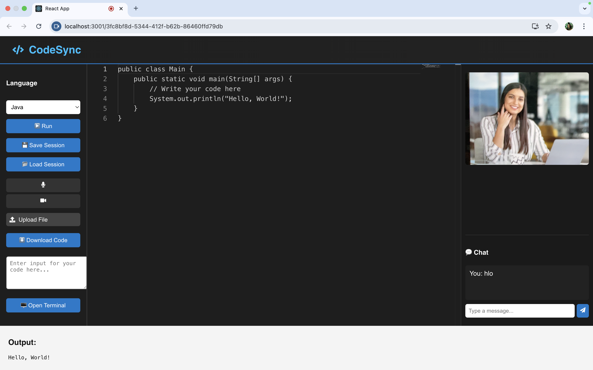
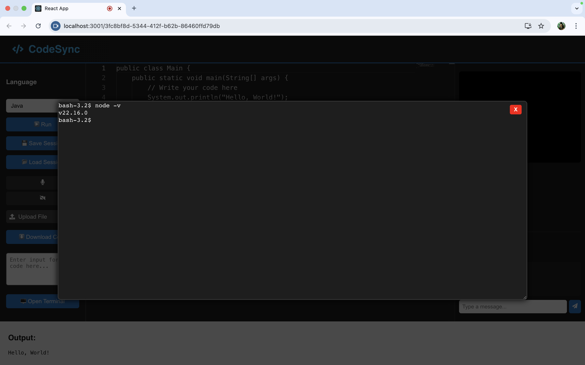
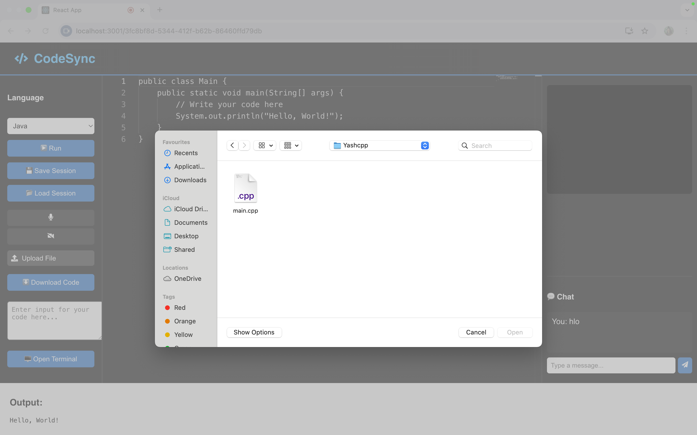

# CodeSync 

> A real-time collaborative coding platform with code editing, chat, audio/video, virtual terminal, and session management — built for teams, classrooms, and hackathons.

---

###  Features

-  **Real-time Code Editor** with Monaco + Socket.IO
-  **Live Chat** for developer communication
-  **Audio/Video Sync** using WebRTC
-  **Virtual Terminal** for collaborative shell input
-  **Save & Load Sessions** to MongoDB
-  **Session Generator** with unique session ID sharing
-  **Upload/Download Files** with correct code file extensions
-  **Run Code** with Judge0 API (supports C, C++, Python, Java)

---

###  Project Structure

```

CodeSync/
├── codesync-frontend/   # React frontend
│   └── src/
│       ├── App.js       # Main collaborative UI
│       └── App.css      # Responsive styling
├── codesync-backend/    # Node.js + Express + MongoDB backend
│   └── index.js         # REST APIs + WebSocket setup
└── .env                 # Environment secrets (Mongo URI, etc.)

````

---

### ⚙️ Setup Instructions

#### 1. Clone the repo
```bash
git clone git@github.com:Kansal-ji/CodeSync.git
cd CodeSync
````

#### 2. Install frontend

```bash
cd codesync-frontend
npm install
```

#### 3. Install backend

```bash
cd ../codesync-backend
npm install
```

#### 4. Set up `.env` (backend)

Create `codesync-backend/.env` and add:

```
MONGO_URI=mongodb+srv://<user>:<pass>@cluster.mongodb.net/?retryWrites=true&w=majority
JUDGE0_API_KEY=your_key_here
```

#### 5. Run app

Start backend:

```bash
cd codesync-backend
node index.js
```

Start frontend:

```bash
cd ../codesync-frontend
npm start
```

---

### 📸 Screenshots
Sure Yash — now that your new screenshots are uploaded and renamed properly, here's the updated Markdown block to paste into your `README.md`:

---

###  Screenshots

| Editor + Chat + Video                                       | Terminal + Session                    |
| ----------------------------------------------------------- | ------------------------------------- |
|  |  |

| Welcome Screen                      | File Upload Dialog                       |
| ----------------------------------- | ---------------------------------------- |
|  |  |

---

###  Contributions

PRs are welcome! To contribute:

* Fork this repo
* Create a feature branch
* Push changes and open a PR

---

### 📜 License

MIT License
© 2025 Yash Kansal

---

### 🔗 Connect with Me

[LinkedIn](https://www.linkedin.com/in/yashkansal/)
[GitHub](https://github.com/Kansal-ji)
[Profile](https://kansal-ji.github.io/Portfolio/)
